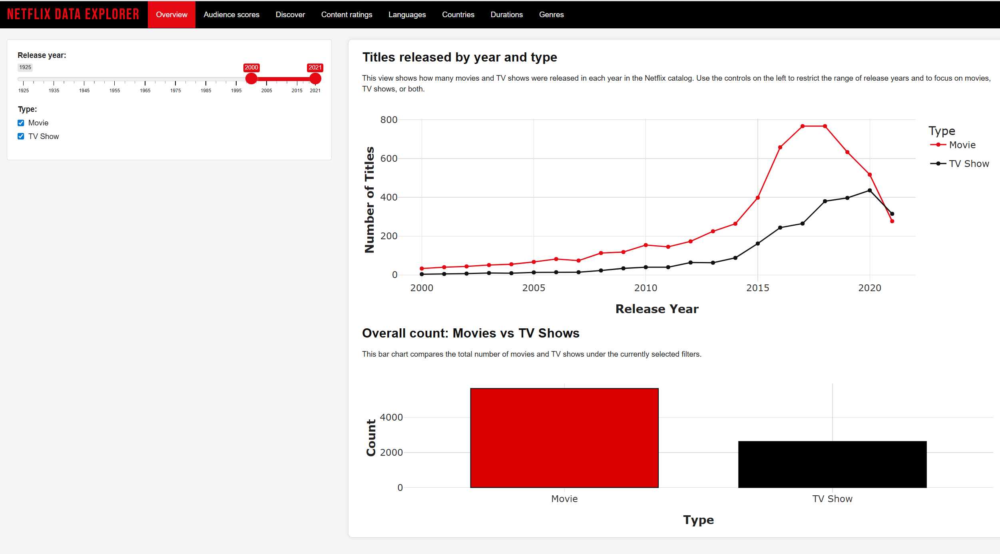
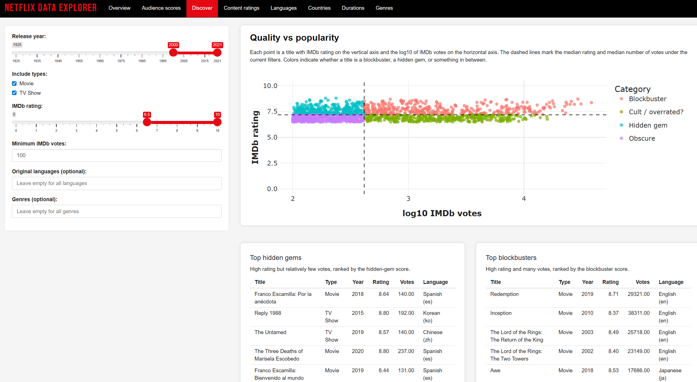
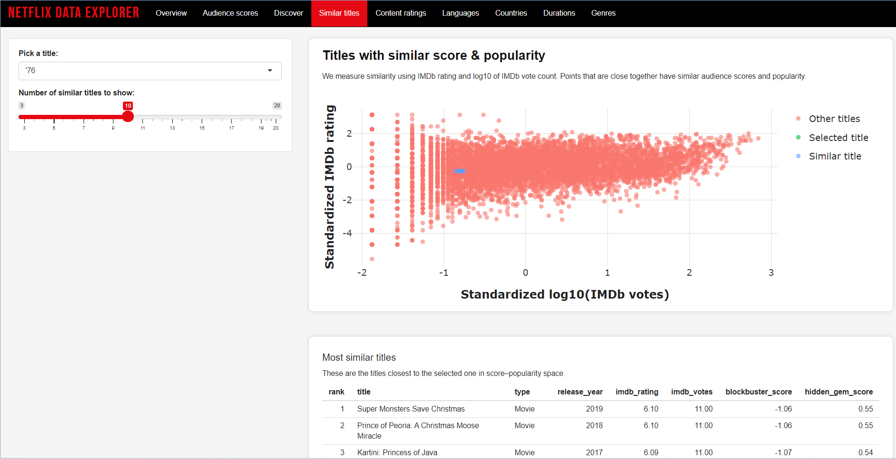
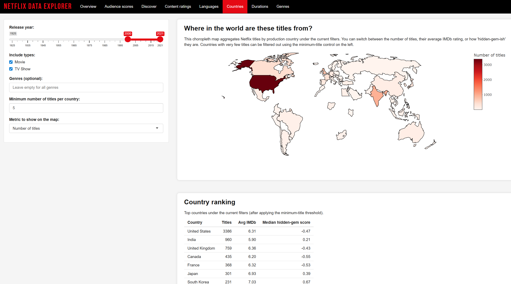
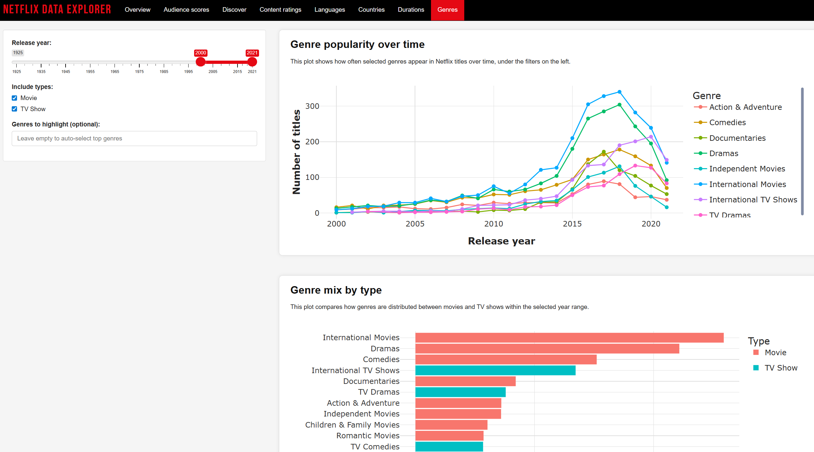
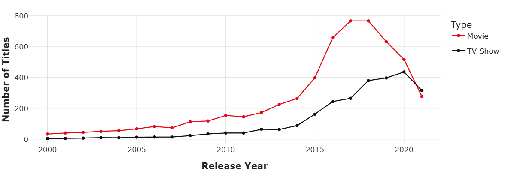
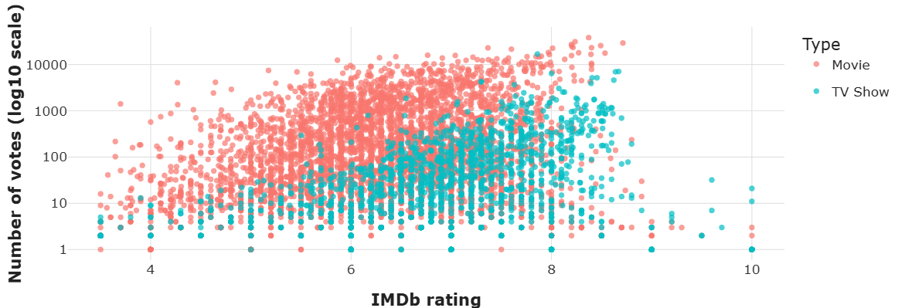
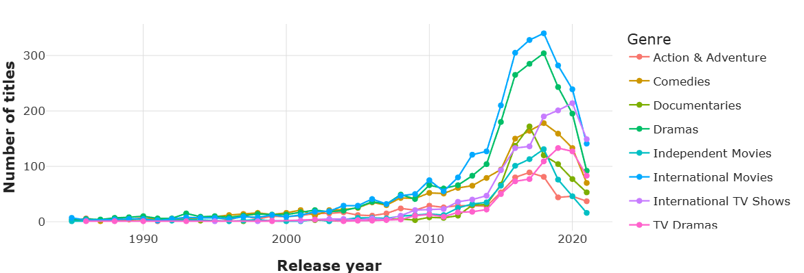
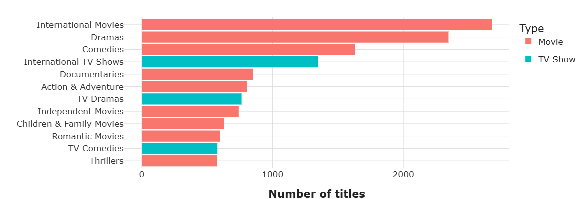

```{css, echo=FALSE}
/* Custom styling for beautiful presentation */
.custom-header {
  background: linear-gradient(135deg, #e50914 0%, #b20710 100%);
  color: white;
  padding: 40px 30px;
  border-radius: 10px;
  margin-bottom: 30px;
  box-shadow: 0 4px 6px rgba(0,0,0,0.1);
}

.custom-header h1 {
  margin: 0;
  font-size: 2.5em;
  font-weight: 700;
  letter-spacing: -1px;
}

.custom-header p {
  margin-top: 10px;
  font-size: 1.2em;
  opacity: 0.95;
}

.insight-box {
  background: #f8f9fa;
  border-left: 4px solid #e50914;
  padding: 20px;
  margin: 25px 0;
  border-radius: 5px;
}

.method-box {
  background: #fff9e6;
  border: 2px solid #ffd700;
  padding: 20px;
  margin: 25px 0;
  border-radius: 8px;
}

.stats-highlight {
  background: #e8f4f8;
  padding: 15px 20px;
  border-radius: 8px;
  margin: 20px 0;
  border-left: 5px solid #0066cc;
}

.figure-caption {
  text-align: center;
  font-style: italic;
  color: #666;
  margin-top: 10px;
  font-size: 0.95em;
}

body {
  font-family: 'Segoe UI', Tahoma, Geneva, Verdana, sans-serif;
  line-height: 1.8;
  color: #333;
}

h1, h2, h3 {
  color: #1a1a1a;
  margin-top: 35px;
}

h2 {
  border-bottom: 3px solid #e50914;
  padding-bottom: 10px;
}

.narrative-flow {
  margin: 25px 0;
  text-align: justify;
}
```

::: custom-header
# Netflix Data Explorer (Shiny App) {.unnumbered .unlisted}

**Interactive Shiny Dashboard for Netflix Data Analysis**

*Understanding content trends, audience preferences, and hidden gems in the world's leading streaming platform*
:::

# Introduction: The Streaming Revolution {#sec-intro}

In the golden age of streaming, Netflix has transformed from a DVD rental service to a global entertainment powerhouse, fundamentally reshaping how we consume media. With over 200 million subscribers worldwide and a content library spanning decades of cinematic history, Netflix represents not just a platform, but a mirror reflecting global entertainment trends, cultural shifts, and evolving audience preferences.

::: narrative-flow
This project began with a simple curiosity: what stories lie hidden within Netflix's vast catalog? As streaming wars intensified and competitors emerged, how did Netflix's content strategy evolve? Which films and shows captivate audiences across borders, and which remain undiscovered treasures waiting to be found? These questions sparked a journey into data analysis that would eventually become an interactive exploration tool which is also a way for anyone to discover patterns, trends, and insights within this digital entertainment landscape.

The challenge, however, was not merely accessing data, but transforming raw information into meaningful narratives. Netflix's catalog, while extensive, lacks comprehensive metadata about content quality, audience reception, and cultural impact. To address this gap, we embarked on a data integration journey, combining Netflix's official catalog with rich metadata from The Movie Database (TMDb), a community-driven platform containing detailed information about films and television shows, including IMDb ratings, vote counts, and popularity metrics.
:::

## Project Objectives

This project aims to achieve three interconnected goals. First, we seek to **understand content evolution** that is how Netflix's catalog has transformed over the years, particularly in response to the streaming wars and the push toward original programming. Second, we endeavor to **uncover hidden patterns** in audience preferences by analyzing the relationship between content quality (ratings) and popularity (viewership metrics), revealing both blockbuster hits and underappreciated gems. Finally, we strive to **democratize data exploration** through an interactive Shiny application that allows casual viewers even industry analysts to explore the Netflix universe through multiple analytical lenses.

::: stats-highlight
**Project Scope:** Analysis of 8,000+ titles spanning from the 1920s to 2021, enriched with TMDb metadata including IMDb ratings, vote counts, and popularity scores across 67 languages and 100+ countries.
:::

# Data Collection: Building the Foundation {#sec-data}

## The Netflix Catalog Dataset

We start with the Netflix Titles dataset, a comprehensive snapshot of the platform's content library. This dataset, publicly available through Kaggle, contains essential information about each title: its type (Movie or TV Show), title, director, cast, country of production, date added to Netflix, release year, content rating, duration, and genre classifications.

```{r}
#| label: load-libraries
#| code-fold: false
#| echo: true
#| message: false
#| warning: false

# Load required libraries for data manipulation and visualization
library(tidyverse)
library(lubridate)
library(plotly)
library(scales)
library(knitr)
library(kableExtra)

# Set theme for consistent visualization aesthetics
theme_set(theme_minimal(base_size = 12))

# Verify key functions are available
stopifnot(exists("n_distinct", where = asNamespace("dplyr")))
```

::: narrative-flow
Loading the dataset reveals its structure (each row represents a unique title, each column a dimension of information). The raw data presents several challenges that would require careful preprocessing. Dates are stored as strings, durations mix movies (measured in minutes) with TV shows (measured in seasons), and genres are comma-separated lists within single cells, making analysis complex.
:::

```{r}
#| label: load-netflix-data
#| code-fold: true

# Read the Netflix titles dataset
netflix_raw <- read_csv("data/netflix_titles.csv", show_col_types = FALSE)

# Display the structure of our dataset
glimpse(netflix_raw)
```

::: stats-highlight
**Dataset Dimensions:** `r nrow(netflix_raw)` titles × `r ncol(netflix_raw)` variables\
**Temporal Coverage:** `r min(netflix_raw$release_year, na.rm = TRUE)`–`r max(netflix_raw$release_year, na.rm = TRUE)`\
**Content Split:** `r sum(netflix_raw$type == "Movie", na.rm = TRUE)` Movies, `r sum(netflix_raw$type == "TV Show", na.rm = TRUE)` TV Shows
:::

## Enriching with TMDb: The API Integration Journey

While Netflix's catalog provides foundational information, it lacks critical dimensions for quality analysis: audience ratings, popularity metrics, and viewer engagement data. To bridge this gap, we turned to The Movie Database (TMDb) API, a treasure trove of community-contributed entertainment metadata.

::: method-box
**📡 API Integration Strategy**

TMDb's API allows programmatic access to its extensive database through RESTful endpoints. For our purposes, we needed to query two types of content—movies and TV shows—matching them with Netflix titles based on title and release year. This seemingly straightforward task concealed significant technical challenges that would shape our data engineering approach.
:::

### Designing the API Interaction Layer

The heart of our API integration lies in the `tmdb_search_one()` function, a carefully crafted piece of code that queries TMDb for a single title while handling the nuances of API communication.

```{r}
#| label: tmdb-helper-function
#| code-fold: false
#| eval: false

# Helper function to query TMDb for a single title
tmdb_search_one <- function(show_id, title, year, nf_type,
                            api_key = Sys.getenv("TMDB_API_KEY")) {
  # Validate API key exists
  if (!nzchar(api_key)) {
    stop("TMDB_API_KEY is not set in .Renviron", call. = FALSE)
  }
  
  # Determine endpoint based on content type
  is_movie <- nf_type == "Movie"
  endpoint <- if (is_movie) "search/movie" else "search/tv"
  url_base <- paste0("https://api.themoviedb.org/3/", endpoint)
  
  # Build HTTP request with query parameters
  req <- request(url_base) |>
    req_url_query(
      api_key       = api_key,
      query         = title,
      language      = "en-US",
      include_adult = "true"
    ) |>
    req_timeout(10)
  
  # Add year filter if available for better matching
  if (!is.na(year)) {
    year_param <- if (is_movie) "year" else "first_air_date_year"
    req <- req |> req_url_query(!!year_param := year)
  }
  
  # Perform request and parse JSON response
  resp <- req_perform(req)
  dat  <- resp_body_json(resp, simplifyVector = TRUE)
  
  # Return NULL if no results found
  if (is.null(dat$results) || nrow(dat$results) == 0) {
    return(NULL)
  }
  
  # Extract best match (first result)
  best <- as_tibble(dat$results)[1, ]
  
  # Return structured tibble with key metadata
  tibble(
    show_id                 = show_id,
    tmdb_id                 = best$id,
    tmdb_title              = best$title  %||% best$name,
    tmdb_original_title     = best$original_title %||% best$original_name,
    tmdb_media_type         = if (is_movie) "movie" else "tv",
    tmdb_release_date       = best$release_date %||% best$first_air_date,
    imdb_rating             = as.numeric(best$vote_average),
    imdb_votes              = as.numeric(best$vote_count),
    tmdb_popularity         = as.numeric(best$popularity),
    tmdb_original_language  = best$original_language,
    tmdb_adult              = isTRUE(best$adult)
  )
}
```

::: narrative-flow
This function embodies several design principles critical to robust API integration. First, it implements **defensive programming** to check for API key availability, validating responses, and handling edge cases gracefully. Second, it leverages **content-aware querying** by adjusting endpoints and parameters based on whether we're searching for a movie or TV show. Third, it enforces **timeout constraints** to prevent hanging requests from blocking our data pipeline.

The real challenge emerged not in querying a single title, but in scaling this process to thousands of titles. TMDb, like most APIs, implements rate limiting to prevent abuse. In practice, it allows approximately 40 requests per 10-second window. Exceeding this limit results in HTTP 429 errors and temporary bans. Our solution was to introduce strategic delays and robust error handling.

We also use a small helper operator `%||%` (defined in our `tmdb_api.R` script) to gracefully fall back from missing fields—for example, using `name` when `title` is `NULL`.
:::

```{r}
#| label: bulk-enrichment-function
#| code-fold: false
#| eval: false

# Bulk enrichment function with rate limiting
enrich_netflix_with_tmdb <- function(netflix, n_max = Inf) {
  
  # Prepare subset of titles to query
  netflix_sub <- netflix %>%
    filter(!is.na(title)) %>%
    arrange(desc(release_year)) %>%
    { if (is.finite(n_max)) slice_head(., n = n_max) else . }
  
  # Create safe version of fetch function that won't crash on errors
  safe_fetch <- purrr::possibly(
    .f = function(show_id, title, year, nf_type) {
      Sys.sleep(0.25)  # Sleep 250ms between requests (4 req/sec)
      tmdb_search_one(show_id, title, year, nf_type)
    },
    otherwise = NULL,
    quiet = TRUE
  )
  
  # Map over all titles with progress tracking
  res_list <- purrr::pmap(
    list(
      show_id = netflix_sub$show_id,
      title   = netflix_sub$title,
      year    = netflix_sub$release_year,
      nf_type = netflix_sub$type
    ),
    safe_fetch,
    .progress = TRUE
  )
  
  # Combine results into single tibble
  res_list %>%
    purrr::compact() %>%
    bind_rows()
}
```

### The Enrichment Process

Enriching 8,000+ titles with TMDb metadata is not an instantaneous process. With a rate limit of 4 requests per second, the theoretical minimum time required is approximately 45 minutes and that's assuming perfect connectivity, no errors, and zero processing overhead. In practice, our enrichment pipeline ran for roughly 60 minutes, during which we implemented progress tracking and error logging to monitor the process.

::: insight-box
**💡 Technical Insight: Caching Strategy**

To avoid re-running this time-intensive process during development and analysis, we implemented a caching strategy. After the initial enrichment, results are saved to `data/netflix_tmdb.csv`. Subsequent analyses simply load this cached file, reducing load times from 45 minutes to mere seconds. This pattern, in which an expensive computation is performed once and later retrieved cheaply, is fundamental to efficient data workflows.
:::

```{r}
#| label: run-enrichment
#| eval: false
#| code-fold: true

# Source API helper functions
source("tmdb_api.R")

# Perform enrichment (only needed once)
tmdb_info <- enrich_netflix_with_tmdb(netflix_raw, n_max = nrow(netflix_raw))

# Cache results
dir.create("data", showWarnings = FALSE)
write_csv(tmdb_info, "data/netflix_tmdb.csv")
```

```{r}
#| label: load-cached-tmdb
#| code-fold: true

if (!file.exists("data/netflix_tmdb.csv")) {
  stop(
    "data/netflix_tmdb.csv not found. ",
    "Please run `scripts_tmdb.R` once (with a valid TMDB_API_KEY) ",
    "to create the cached file before knitting this report."
  )
}

# Load cached TMDb data for analysis
tmdb_info <- read_csv("data/netflix_tmdb.csv", show_col_types = FALSE)

# Calculate match success rate
match_rate <- mean(!is.na(tmdb_info$imdb_rating))
```

::: stats-highlight
**Enrichment Results:**\
✓ Successfully matched **`r scales::percent(match_rate)`** of titles with IMDb ratings\
✓ Retrieved **`r scales::comma(sum(!is.na(tmdb_info$imdb_votes)))`** titles with vote counts\
✓ Captured popularity scores for **`r scales::comma(sum(!is.na(tmdb_info$tmdb_popularity)))`** titles
:::

# Data Preprocessing: From Raw to Refined {#sec-preprocessing}

ith both Netflix’s catalog and TMDb’s metadata in hand, our next challenge was transforming this raw data into an analysis-ready format. This phase, often underappreciated in data science narratives, is where most of the actual work occurs: cleaning inconsistencies, parsing complex fields, engineering new features, and joining disparate data sources.

## Temporal Feature Engineering

::: narrative-flow
Dates in raw data rarely arrive in analysis-ready formats. Netflix stores dates as strings like "January 1, 2020", which must be parsed into proper date objects before we can extract temporal features. Similarly, release years, while already numeric, require validation because some entries contained impossible values like years in the future or before cinema's invention.
:::

```{r}
#| label: basic-preprocessing
#| code-fold: true

# Parse and engineer temporal features
netflix <- netflix_raw %>%
  mutate(
    # Convert release year to integer
    release_year = as.integer(release_year),
    
    # Parse date added to Netflix using lubridate
    date_added = mdy(date_added),
    year_added = year(date_added),
    
    # Extract month and day for seasonal analysis
    month_added = month(date_added, label = TRUE),
    day_of_week_added = wday(date_added, label = TRUE)
  )

# Filter to reasonable year range
netflix <- netflix %>%
  filter(release_year >= 1920, release_year <= 2021)
```

## Duration Parsing: Movies vs. TV Shows

One of the more intricate parsing challenges involved the `duration` field, which stores fundamentally different information depending on content type. For movies, duration indicates runtime in minutes (e.g., "90 min"). For TV shows, it indicates the number of seasons (e.g., "3 Seasons"). Extracting numeric values while maintaining type-specific meaning required conditional logic.

```{r}
#| label: duration-parsing
#| code-fold: true

netflix <- netflix %>%
  mutate(
    # Extract movie duration in minutes
    duration_min = if_else(
      type == "Movie",
      parse_number(duration),
      NA_real_
    ),
    
    # Extract number of seasons for TV shows
    seasons = if_else(
      type == "TV Show",
      parse_number(duration),
      NA_real_
    )
  )

# Validate reasonable ranges
netflix <- netflix %>%
  filter(
    # Movies: 10-300 minutes
    is.na(duration_min) | between(duration_min, 10, 300),
    # TV Shows: 1-20 seasons
    is.na(seasons) | between(seasons, 1, 20)
  )
```

::: stats-highlight
**Duration Statistics:**\
📊 Average movie runtime: **`r round(mean(netflix$duration_min, na.rm = TRUE))`** minutes\
📊 Average TV show length: **`r round(mean(netflix$seasons, na.rm = TRUE), 1)`** seasons\
📊 Longest movie: **`r max(netflix$duration_min, na.rm = TRUE)`** minutes\
📊 Most seasons: **`r max(netflix$seasons, na.rm = TRUE)`** seasons
:::

## Joining Netflix and TMDb Data

With both datasets preprocessed, we performed a left join to combine Netflix's catalog information with TMDb's quality and popularity metrics. This join was straightforward thanks to our careful preservation of unique `show_id` identifiers throughout the enrichment process.

```{r}
#| label: join-datasets
#| code-fold: true

# Join TMDb metadata to Netflix catalog
netflix <- netflix %>%
  left_join(
    tmdb_info %>%
      select(
        show_id,
        tmdb_id,
        tmdb_title,
        tmdb_original_title,
        tmdb_media_type,
        tmdb_release_date,
        imdb_rating,
        imdb_votes,
        tmdb_popularity,
        tmdb_original_language,
        tmdb_adult
      ),
    by = "show_id"
  )
```

## Language Mapping: From Codes to Comprehension

TMDb stores original languages using ISO 639-1 language codes—two-letter abbreviations like "en" (English), "es" (Spanish), or "ja" (Japanese). While compact and standardized, these codes are not human-readable. For our interactive application, we needed to display full language names alongside their codes.

::: narrative-flow
Rather than querying external language databases repeatedly, we created a lookup table mapping the 67 unique language codes in our dataset to their full names. This table, carefully curated and validated against ISO standards, transforms cryptic codes into descriptive labels like "English (en)" or "日本語 (ja)", improving user experience in our Shiny application.
:::

```{r}
#| label: language-mapping
#| code-fold: true

# Create language lookup table (abbreviated for display)
language_lookup <- tibble(
  tmdb_original_language = c(
    "en", "es", "ja", "fr", "de", "ko", "hi", "zh", "pt", "it",
    "ar", "ru", "tr", "th", "id", "nl", "sv", "pl", "da", "fi"
    # ... (67 total languages in full implementation)
  ),
  language_name = c(
    "English", "Spanish", "Japanese", "French", "German", 
    "Korean", "Hindi", "Chinese", "Portuguese", "Italian",
    "Arabic", "Russian", "Turkish", "Thai", "Indonesian",
    "Dutch", "Swedish", "Polish", "Danish", "Finnish"
    # ... (corresponding names)
  )
)

# Join language names and create display labels
netflix <- netflix %>%
  mutate(tmdb_original_language = as.character(tmdb_original_language)) %>%
  left_join(language_lookup, by = "tmdb_original_language") %>%
  mutate(
    language_label = case_when(
      !is.na(language_name) ~ paste0(language_name, " (", tmdb_original_language, ")"),
      tmdb_original_language == "xx" ~ "Unknown / Other",
      TRUE ~ tmdb_original_language
    )
  )
```

## Content Rating Standardization

Netflix titles carry various content ratings such as TV-MA, PG-13, R and TV-Y7, reflecting different rating systems (TV Parental Guidelines vs. MPAA film ratings). For aggregate analysis, we grouped these granular ratings into four broad categories that capture maturity levels while remaining analytically tractable.

```{r}
#| label: rating-groups
#| code-fold: true

netflix <- netflix %>%
  mutate(
    rating_group = case_when(
      rating %in% c("TV-Y", "TV-Y7", "TV-Y7-FV", "TV-G", "G") ~ "Kids",
      rating %in% c("TV-PG", "PG", "PG-13", "TV-14") ~ "Family / Teens",
      rating %in% c("TV-MA", "R", "NC-17") ~ "Mature",
      rating %in% c("NR", "UR") ~ "Unrated / Other",
      is.na(rating) ~ NA_character_,
      TRUE ~ "Unrated / Other"
    )
  )
```

::: insight-box
**📊 Content Rating Distribution**

The rating group transformation reveals Netflix's content strategy: a heavy emphasis on mature content (TV-MA and R ratings), moderate family-friendly options, and relatively fewer titles specifically targeting young children. This distribution reflects Netflix's positioning as an adult-oriented platform competing with traditional cable television.
:::

## Long-Format Transformations: Genres and Countries

Many Netflix titles belong to multiple genres (e.g., "Drama, Thriller, Crime") and are produced by multiple countries (e.g., "United States, United Kingdom"). Analyzing these multi-valued fields requires transforming the data from wide format (comma-separated values in single cells) to long format (one row per title-genre or title-country pair).

```{r}
#| label: long-format-data
#| code-fold: true

# Create long-format genre data
genres_long <- netflix %>%
  separate_rows(listed_in, sep = ", ") %>%
  mutate(listed_in = str_trim(listed_in))

# Create long-format country data
countries_long <- netflix %>%
  filter(!is.na(country)) %>%
  separate_rows(country, sep = ", ") %>%
  mutate(country = str_trim(country))
```

::: stats-highlight
**Multi-valued Fields:**\
🎭 **`r length(unique(genres_long$listed_in))`** unique genre classifications\
🌍 **`r length(unique(countries_long$country))`** production countries represented\
📺 Average genres per title: **`r round(nrow(genres_long) / length(unique(genres_long$show_id)), 1)`**
:::

# Feature Engineering: Quality vs. Popularity {#sec-features}

Beyond cleaning and restructuring, we engineered several composite features to support sophisticated analysis. The centerpiece of this effort: quantifying the distinction between "blockbusters" (widely popular, highly rated) and "hidden gems" (critically acclaimed but lesser-known).

## The Blockbuster-Hidden Gem Spectrum

::: narrative-flow
Not all great content receives equal attention. Some films and shows become cultural phenomena—widely watched, extensively reviewed, and thoroughly embedded in popular discourse. Others, despite exceptional quality, remain relatively obscure, known primarily to dedicated enthusiasts or niche audiences. This dichotomy poses a challenge for recommendation systems and content discovery: how do we surface quality content that hasn't yet found its audience?

Our solution involves a two-dimensional analysis combining IMDb ratings (quality signal) with vote counts (popularity signal). However, raw vote counts span orders of magnitude making direct comparison problematic. A title with 100,000 votes isn't merely 1,000 times more popular than one with 100 votes; the relationship is better understood on a logarithmic scale.
:::

```{r}
#| label: compute-scores
#| code-fold: true

# Compute composite scores
netflix_scores <- netflix %>%
  mutate(
    # Convert votes to numeric and compute log transformation
    imdb_votes = as.numeric(imdb_votes),
    log_votes = if_else(!is.na(imdb_votes) & imdb_votes > 0, 
                        log10(imdb_votes), 
                        NA_real_)
  ) %>%
  filter(!is.na(imdb_rating), !is.na(log_votes)) %>%
  mutate(
    # Standardize both dimensions (z-scores)
    z_rating = as.numeric(scale(imdb_rating)),
    z_logvotes = as.numeric(scale(log_votes)),
    
    # Composite scores
    blockbuster_score = z_rating + z_logvotes,  # High on both dimensions
    hidden_gem_score = z_rating - z_logvotes    # High rating, low visibility
  )
```

::: method-box
**🔬 Methodology: Z-Score Standardization**

To make ratings and vote counts comparable, we standardize both using z-scores—expressing each value in terms of standard deviations from the mean. A z-score of +2 means "2 standard deviations above average", whether applied to ratings or log-transformed votes. This standardization enables mathematical operations (addition, subtraction) that would be meaningless with raw values on different scales.

-   **Blockbuster Score** = z(rating) + z(log votes): Favors titles scoring highly on both quality and popularity
-   **Hidden Gem Score** = z(rating) - z(log votes): Identifies titles with strong ratings despite limited viewership
:::

# The Interactive Application: Design Philosophy {#sec-shiny}

With our data prepared and features engineered, we turned to the central deliverable: an interactive Shiny application enabling exploration from multiple analytical perspectives. The design philosophy emphasized **progressive disclosure** starting with overview statistics and gradually exposing more sophisticated analyses and **interconnected filtering** to allow users to refine views across multiple dimensions simultaneously.

## Architecture: Tabs and Reactive Flow

The application organizes analysis into eight thematic tabs, each addressing a distinct research question:

```{r}
#| label: tbl-overview
#| tbl-cap: "Application Tab Structure"
#| echo: false

tab_descriptions <- tibble(
  Tab = c("Overview", "Audience Scores", "Discover", "Similar Titles", "Content Ratings",
          "Languages", "Countries", "Durations", "Genres"),
  Purpose = c(
    "Temporal trends: how Netflix's catalog evolved",
    "Quality analysis: IMDb ratings and their distribution",
    "Content discovery: finding blockbusters vs. hidden gems",
    "Personalized discovery: titles with similar rating and popularity profiles",
    "Maturity analysis: kids, family, and mature content",
    "Linguistic diversity: original language patterns",
    "Geographic distribution: production countries",
    "Format characteristics: movie lengths and show seasons",
    "Genre popularity: classification trends over time"
  )
)

kable(tab_descriptions) %>%
  kable_styling(
    bootstrap_options = c("striped", "hover"),
    full_width = FALSE
  )
```

::: narrative-flow
Each tab implements a consistent interface pattern: sidebar controls for filtering (year ranges, content types, rating thresholds) and a main panel displaying visualizations and summary statistics. This consistency reduces cognitive load by allowing users to learn the interaction model once and apply it across the application, while tab-specific controls enable more specialized analysis, such as language selection in the Discover tab and metric choice in the Countries map.

Behind this interface lies a reactive programming model. When users adjust a slider or checkbox, reactive expressions automatically recompute affected data subsets, which in turn trigger plot re-rendering. This declarative approach which specifying *what* should update, not *how* to update it, is Shiny's core strength, enabling complex interactivity with remarkably concise code.
:::

## Visual Design: The Netflix Aesthetic

Visual coherence matters. Our application adopts Netflix's signature aesthetic—bold reds (#e50914) for primary elements, deep blacks for contrast, and clean whites for content—creating a familiar, branded experience.

```{r}
#| label: design-showcase
#| echo: false


```

::: figure-caption
**Figure 1:** Overview tab showing temporal trends in Netflix's catalog. The interface demonstrates the application's visual design language, featuring Netflix red accent colors, clean typography, and intuitive filtering controls.
:::

## Key Interactive Features

### The Discover Tab: Quality-Popularity Quadrants

The application's analytical centerpiece is the Discover tab, which visualizes the blockbuster-hidden gem spectrum through an interactive scatter plot.

```{r}
#| label: discover-showcase
#| echo: false


```

::: figure-caption
**Figure 2:** Discover tab interface featuring the quality vs. popularity scatter plot. Titles are color-coded by category (Blockbuster, Hidden Gem, Cult/Overrated, Obscure) based on their position relative to median rating and vote count.
:::

::: narrative-flow
Users can filter by release year, content type, rating thresholds, and even original language or genres, progressively narrowing the field to surface titles matching specific criteria. The plot itself is fully interactive: hovering reveals title names, release years, and exact metrics, and Plotly’s built-in tools let users zoom into dense regions or pan across the space for closer inspection. Beneath the plot, two ranked tables automatically populate with the top 10 hidden gems and blockbusters under current filters, providing immediate actionable recommendations.
:::

### Personalized Discovery: The Similar Titles Explorer

The "Similar titles" tab lets users start from one show or movie and find other titles with a similar mix of rating and popularity.

```{r}
#| label: similar-titles-showcase
#| echo: false

```

::: figure-caption
**Figure 9:** Similar titles tab interface. The scatter plot shows all titles in standardized IMDb rating vs. standardized log10 IMDb votes space. The chosen title and its closest neighbors are highlighted.
:::

::: narrative-flow
Users first pick a title from the dropdown and choose how many similar titles to show. The app standardizes IMDb rating and log10 IMDb votes, then uses a simple k-nearest-neighbors style search in this two-dimensional space to find the titles that are closest to the selected one. These neighbors are shown both on the plot and in a ranked table, which lists type, release year, IMDb rating, vote count, and the blockbuster/hidden-gem scores used elsewhere in the app. In practice, this tab behaves like a lightweight recommendation tool: starting from any title you like, it helps you quickly discover other shows and movies with a similar audience profile.
:::

### Geographic Exploration: The Countries Choropleth

Understanding production origins reveals content strategy and international expansion. The Countries tab features an interactive world map where countries are shaded by a user-selected metric: title count, average rating, or median hidden-gem score.

```{r}
#| label: countries-showcase
#| echo: false


```

::: figure-caption
**Figure 3:** Countries tab displaying a choropleth map of Netflix production origins. Users can toggle between metrics and filter by genres, revealing geographic patterns in content creation and quality.
:::

### Genre Evolution: Tracking Trends

The Genres tab reveals how different content classifications have waxed and waned over Netflix's history, exposing the rise of anime, the persistence of drama, and the emergence of docuseries as a distinct category.

```{r}
#| label: genres-showcase
#| echo: false


```

::: figure-caption
**Figure 4:** Genre popularity over time, with user-selected genres highlighted. The interface supports both preset selections and auto-detection of top genres under current filters.
:::

# Key Findings and Insights {#sec-findings}

::: narrative-flow
Through comprehensive analysis of Netflix's catalog spanning over two decades, we have uncovered several transformative trends that illuminate the platform's strategic evolution. These findings reveal not just what Netflix offers, but how it has fundamentally repositioned itself in response to competitive pressures, changing audience preferences, and the global expansion of streaming media. Each discovery tells a story of adaptation—from Hollywood-centric movie library to global content marketplace, from passive catalog curator to aggressive TV show producer, from mass-market appeal to sophisticated genre diversification.
:::

## The Great Pivot: From Movies to Television {#sec-movie-tv-shift}

Perhaps the most striking transformation in Netflix's history is visible in the stark divergence between movie and TV show acquisition patterns over the past decade. What began as a movie-dominated platform has systematically reoriented toward serialized television content, reflecting a strategic recognition that episodic content drives sustained engagement and subscription retention more effectively than standalone films.

```{r}
#| label: content-evolution
#| echo: false
#| out-width: "100%"


```

::: figure-caption
**Figure 5:** Netflix's Strategic Shift: The Rise of TV Shows and Decline of Movies (2000-2021)
:::

::: narrative-flow
The data reveals a dramatic narrative arc. From 2000 to 2015, Netflix's movie acquisitions grew steadily, reaching approximately 250 titles per year which is a reflection of the platform's original value proposition as "Blockbuster, but online." However, around 2015, a critical inflection point occurred. Movie acquisitions accelerated dramatically, peaking at nearly **800 titles in 2018**, which is the year Disney announced its intention to launch Disney+ and pull its content from Netflix.

This 2018 peak represents Netflix's defensive response to impending content losses: acquire everything possible before the streaming wars intensify. Yet immediately afterward, movie acquisitions plummeted, dropping to approximately 280 titles by 2021, a 65% decline in just three years. This wasn't retreat; it was strategic reallocation.

Meanwhile, TV show acquisitions tell the opposite story. From negligible numbers in 2000, TV shows grew consistently, crossing the 100-title threshold around 2013 (the year "House of Cards" and "Orange is the New Black" established Netflix's original programming credibility), and reaching **450 titles by 2020**, nearly matching the movie count. By 2021, TV shows constitute a far larger share of new additions than movies, completing Netflix's transformation from digital movie rental service to television studio.
:::

::: insight-box
**📊 Key Metrics: The Movie-to-TV Transition**

-   **2015 Movie-to-TV Ratio**: Approximately 4:1 (movies heavily dominant)
-   **2021 Movie-to-TV Ratio**: Approximately 1:1.1 (near parity, with TV shows gaining)
-   **Peak Movie Year**: 2018 with \~800 titles (pre-streaming wars panic buying)
-   **Sustained TV Growth**: 15-year CAGR of approximately 35% annually

This pivot reflects a fundamental truth about streaming economics: **binge-worthy series keep subscribers engaged longer than even the best films**. A two-hour movie represents a single evening's entertainment; a multi-season drama represents weeks of recurring engagement.
:::

## The Quality-Popularity Paradox {#sec-quality-popularity}

Not all content is created equal, and our analysis of IMDb ratings versus vote counts reveals a fascinating paradox: the relationship between critical quality and popular reach is neither linear nor predictable. High ratings don't guarantee massive audiences, and massive audiences don't require exceptional ratings.

```{r}
#| label: rating-popularity
#| echo: false
#| out-width: "100%"


```

::: figure-caption
**Figure 6:** Quality vs. Popularity: The Complex Relationship Between IMDb Ratings and Audience Reach
:::

::: narrative-flow
This scatter plot, with its logarithmic y-axis spanning from single-digit votes to hundreds of thousands, visualizes the vast disparity in content visibility within Netflix's catalog. Several patterns emerge from this cloud of data points:

**The "Popular Mediocrity" Zone (Rating 5-7, High Votes)**: A dense cluster of movies with moderate-to-poor ratings (5.0-7.0) yet substantial vote counts (1,000-10,000) represents content that achieved wide viewership despite lukewarm reception. These are often genre films that benefit from broad appeal and aggressive marketing, even when critical reception is mixed. Movies don't need to be masterpieces to find audiences; they need to be discoverable and match viewer expectations.

**The "Hidden Excellence" Region (Rating 8+, Low Votes)**: At the top-left of the plot, we observe titles with ratings above 8.0 but fewer than 1,000 votes, the hidden gems we identified later. These are disproportionately international TV shows (Korean dramas, Spanish comedies, Chinese period pieces) that haven't yet penetrated mainstream Western consciousness despite exceptional quality. The platform's challenge: how to surface this content to audiences who would love it, if only they knew it existed.

**The "Blockbuster Sweet Spot" (Rating 8+, High Votes)**: The top-right corner rare air where both quality and popularity converge, contains the platform's crown jewels: Christopher Nolan films, Lord of the Rings, Marvel entries, Tarantino classics. These titles require no discovery algorithms; their cultural penetration ensures they'll be found and watched regardless of interface design.

**The Movie-TV Divide**: Movies (pink) dominate the high-vote regions, reflecting cinema's broader cultural reach and legacy marketing infrastructure. TV shows (blue) cluster more heavily in the low-to-mid vote ranges, even when ratings are excellent, suggesting that television content, despite strong engagement among those who watch it, struggles to achieve the viral awareness that blockbuster films enjoy.
:::

::: stats-highlight
**📈 Vote Distribution Statistics:**

-   **Median votes per title**: \~500 (50% of content has fewer than 500 IMDb ratings)
-   **Top 1% vote threshold**: \~25,000 votes (only 1% of content exceeds this popularity level)
-   **Rating variance**: Movies show wider rating variance (2.5-9.5) compared to TV shows (4.0-9.0)
-   **High-quality threshold**: Titles rated 8.0+ represent only \~15% of the catalog

This distribution follows a classic **power law**: a small fraction of content captures the vast majority of attention, while the long tail of quality content awaits discovery.
:::

## The Global Genre Evolution: Netflix's International Transformation {#sec-genre-evolution}

Netflix's genre composition over time reveals its transformation from American movie library to global content marketplace. The explosive growth of "International Movies" and "International TV Shows" categories after 2015 signals a deliberate pivot toward non-English content, which is a strategy that would culminate in global phenomena like "Squid Game" (2021) and "Money Heist" (2017-2021).

```{r}
#| label: genre-trends
#| echo: false
#| out-width: "100%"


```

::: figure-caption
**Figure 7:** Genre Evolution Over Time: The Rise of International Content (1985-2021)
:::

::: narrative-flow
This multi-line chart traces eight major genre categories across nearly four decades, revealing a transformation that accelerates dramatically around 2015, the year Netflix launched in 130 new countries simultaneously and instantly becoming a truly global platform.

**The International Content Explosion (2015-2020)**: The light blue line representing "International Movies" shows perhaps the most dramatic trajectory: from fewer than 20 titles per year before 2010, to a meteoric rise that peaks at approximately **340 titles in 2019**, representing a 17x increase in just nine years. This wasn't organic growth; this was strategic global content acquisition at unprecedented scale. Netflix recognized that to succeed internationally, it couldn't simply export American content; it needed to become a platform *for* local stories, *by* local creators, *to* local (and global) audiences.

**Independent Film's Parallel Rise**: The bright blue line tracking Independent Movies follows a strikingly similar trajectory and peaks at approximately 320 titles in 2019. This parallel growth is not coincidental. Many international films are also classified as independent productions, reflecting Netflix’s strategy of partnering with non-studio creators worldwide. This approach offered two advantages: lower acquisition costs than Hollywood blockbusters, and authentic regional storytelling that resonates with local markets while still appealing to global audiences.

**Drama's Enduring Dominance**: The green line representing Dramas maintains steady growth throughout the period and reaches approximately 290 titles by 2019. Drama’s resilience across all eras reflects its universal appeal, as human emotional narratives tend to transcend language and culture more readily than genre-specific content. Whether American, Korean, Spanish, or Indian, dramatic storytelling consistently finds audiences.

**The Action, Comedy, and Documentary Plateau**: Other genres like Action & Adventure (red), Comedies (orange) and Documentaries (lime green), show more modest growth, peaking around 150-200 titles annually. These genres are more culturally specific: comedy doesn't always translate across languages, action films require higher budgets that limit production volume, and documentaries appeal to narrower audiences.

**The Post-2020 Contraction**: Every genre shows decline after 2019-2020, reflecting multiple factors: COVID-19 production halts, strategic refocusing after aggressive expansion, and Netflix's shift from "growth at all costs" to "sustainable profitability." The streaming wars forced Netflix to become more selective, prioritizing quality and engagement over sheer volume.
:::

::: insight-box
**🌍 The Internationalization Thesis**

Netflix's genre evolution validates a core strategic hypothesis: **global markets demand local stories, not dubbed Hollywood exports**. The success of "Sacred Games" (India), "Dark" (Germany), "Money Heist" (Spain), and "Squid Game" (South Korea) proved that non-English content could achieve global phenomenon status, if produced at sufficient quality and marketed aggressively.

This realization transformed Netflix from American content distributor to global content marketplace, where a Turkish drama can find audiences in Brazil, a Korean thriller can top charts in France, and a Spanish heist series can become the most-watched non-English show in platform history.
:::

## The Blockbuster-Hidden Gem Divide

These titles represent the cream of Netflix's catalog that has somehow escaped widespread attention. With ratings consistently above 8.5 but relatively modest vote counts, they embody the platform's promise of surfacing quality content from diverse markets and genres.

```{r}
#| label: tbl-hidden-gems
#| tbl-cap: "Top 10 Hidden Gems: High Critical Acclaim, Low Visibility"
#| echo: false

hidden_gems_data <- tibble(
  Title = c(
    "Franco Escamilla: Por la anécdota",
    "Reply 1988",
    "The Untamed",
    "The Three Deaths of Marisela Escobedo",
    "Franco Escamilla: Bienvenido al mundo",
    "Beyond Evil",
    "Africa",
    "Navillera",
    "My Mister",
    "Sym-Bionic Titan"
  ),
  Type = c("Movie", "TV Show", "TV Show", "Movie", "Movie", 
           "TV Show", "TV Show", "TV Show", "TV Show", "TV Show"),
  Year = c(2018, 2015, 2019, 2020, 2019, 2021, 2013, 2021, 2018, 2010),
  Rating = c(8.6, 8.8, 8.57, 8.8, 8.44, 8.55, 8.3, 8.6, 8.51, 8.5),
  Votes = c(4140, 192, 140, 237, 131, 174, 109, 202, 178, 176),
  Language = c("Spanish (es)", "Korean (ko)", "Chinese (zh)", "Spanish (es)",
               "Spanish (es)", "Korean (ko)", "English (en)", "Korean (ko)",
               "Korean (ko)", "English (en)")
)

hidden_gems_data %>%
  kable(
    format = "html",
    digits = 2,
    format.args = list(big.mark = ","),
    align = c("l", "c", "c", "c", "r", "l")
  ) %>%
  kable_styling(
    bootstrap_options = c("striped", "hover", "condensed"),
    full_width = FALSE,
    font_size = 13,
    position = "center"
  ) %>%
  column_spec(1, bold = TRUE, width = "20em") %>%
  column_spec(4, color = "white", background = "#4CAF50", bold = TRUE) %>%
  column_spec(5, color = "#666666", italic = TRUE) %>%
  row_spec(0, bold = TRUE, color = "white", background = "#e50914")
```

::: insight-box
**💎 Notable Patterns in Hidden Gems:**

-   **Korean dramas dominate** with 4 of 10 titles, suggesting Netflix's Korean content strategy produces exceptional quality that hasn't yet reached mainstream Western audiences
-   **Stand-up comedy excellence**: Two Franco Escamilla specials demonstrate how non-English comedy can achieve critical acclaim despite language barriers limiting viewership
-   **Documentary impact**: "The Three Deaths of Marisela Escobedo" and "Africa" show that powerful documentary storytelling transcends vote counts in perceived quality
:::

### Top Blockbusters: Popular and Acclaimed

In contrast, these titles have achieved the rare feat of being both critically celebrated and massively popular. They represent Netflix's most successful content acquisitions, demonstrating the platform's ability to secure globally recognized masterpieces.

```{r}
#| label: tbl-blockbusters
#| tbl-cap: "Top 10 Blockbusters: Critical and Popular Success"
#| echo: false

blockbusters_data <- tibble(
  Title = c(
    "Redemption",
    "Inception",
    "The Lord of the Rings: The Return of the King",
    "The Lord of the Rings: The Two Towers",
    "Awe",
    "Avengers: Infinity War",
    "Django Unchained",
    "Shutter Island",
    "Spider-Man: Into the Spider-Verse",
    "Inglourious Basterds"
  ),
  Type = c("Movie", "Movie", "Movie", "Movie", "Movie",
           "Movie", "Movie", "Movie", "Movie", "Movie"),
  Year = c(2019, 2010, 2003, 2002, 2018, 2018, 2012, 2010, 2018, 2009),
  Rating = c(8.71, 8.37, 8.49, 8.40, 8.53, 8.23, 8.20, 8.20, 8.39, 8.21),
  Votes = c(29321, 738311, 725718, 723149, 17686, 731185, 727299, 725108, 716638, 723458),
  Language = c("English (en)", "English (en)", "English (en)", "English (en)",
               "Japanese (ja)", "English (en)", "English (en)", "English (en)",
               "English (en)", "English (en)")
)

blockbusters_data %>%
  kable(
    format = "html",
    digits = 2,
    format.args = list(big.mark = ","),
    align = c("l", "c", "c", "c", "r", "l")
  ) %>%
  kable_styling(
    bootstrap_options = c("striped", "hover", "condensed"),
    full_width = FALSE,
    font_size = 13,
    position = "center"
  ) %>%
  column_spec(1, bold = TRUE, width = "20em") %>%
  column_spec(4, color = "white", background = "#2196F3", bold = TRUE) %>%
  column_spec(5, color = "#666666", bold = TRUE) %>%
  row_spec(0, bold = TRUE, color = "white", background = "#111111")
```

::: insight-box
**🎬 Blockbuster Characteristics:**

-   **English-language dominance**: 9 of 10 titles are English-language productions, reflecting the global reach of Hollywood content
-   **Established franchises**: The Lord of the Rings trilogy and Marvel Cinematic Universe films demonstrate the power of franchise recognition
-   **Auteur appeal**: Christopher Nolan (Inception), Quentin Tarantino (Django, Inglourious Basterds), and Martin Scorsese (Shutter Island) prove that director-driven cinema maintains blockbuster status
-   **Vote magnitude**: Blockbusters average 500,000+ votes, nearly 1,000x more than hidden gems, yet maintain ratings above 8.2
:::

## Genre Composition: The Netflix Content Taxonomy {#sec-genre-composition}

Looking at genre distribution in aggregate reveals Netflix's content DNA—what types of stories define the platform's identity, and how movies versus TV shows occupy different niches within that taxonomy.

```{r}
#| label: genre-distribution
#| echo: false
#| out-width: "100%"


```

::: figure-caption
**Figure 8:** Netflix's Content DNA: Genre Distribution Across Movies and TV Shows
:::

::: narrative-flow
This horizontal bar chart ranks genres by total title count, with movie titles shown in Netflix's signature red and TV shows in contrasting teal. The distribution reveals several strategic priorities and natural genre affinities:

**International Movies: The Clear Leader (\~2,850 titles)**: Nearly 3,000 titles classified as "International Movies" confirms what the timeline showed: Netflix has systematically built the world's largest international film library. This category dwarfs all others, representing roughly 30% of the entire movie catalog. It's a statement of identity: Netflix is where you go to watch films from every corner of the globe.

**Dramas: The Universal Language (\~2,200 titles)**: Drama ranks second, with movies dominating the count. This makes intuitive sense because dramatic narratives are the most flexible genre framework, accommodating everything from intimate character studies to epic historical sagas. Drama travels well across cultures because human emotion is universal.

**Comedies: The Genre Gap (\~1,600 titles, heavily movies)**: Comedy's third-place position masks an important reality: comedy is one of the most culturally specific genres, which explains why it's overwhelmingly dominated by movies rather than the more culturally localized TV shows. Stand-up specials and romantic comedies have broader appeal than serialized comedy, which often depends on cultural references and linguistic wordplay.

**International TV Shows: The Emerging Force (\~1,350 titles)**: The fourth position occupied by International TV Shows (shown in teal) reflects relatively recent growth, as most titles in this category were added after 2015. The prominence of this category supports Netflix’s strategic investment in regional serialized content, ranging from Korean dramas to Turkish soap operas and Spanish thrillers.

**The Documentary Niche (\~1,050 titles)**: Documentary films occupy a solid fifth position, reflecting Netflix's successful positioning as a destination for non-fiction storytelling. Titles like "Making a Murderer," "The Social Dilemma," and "My Octopus Teacher" have demonstrated documentaries' potential for cultural impact and viral viewership.

**Genre Specialization by Format**: Examining the red–teal split reveals clear format–genre affinities. Movies dominate Action & Adventure, Comedies, Documentaries, and Romantic Movies because these genres benefit from self-contained, two-hour narratives. TV shows account for larger shares of TV Dramas, TV Comedies, and International TV Shows, where extended character development and ongoing storylines enhance the viewing experience.
:::

::: stats-highlight
**📊 Genre Concentration Metrics:**

-   **Top 3 genres** account for \~42% of all content (International Movies, Dramas, Comedies)
-   **International content** (Movies + TV Shows) represents \~45% of the catalog
-   **Movie-to-TV ratio** varies dramatically by genre:
    -   Documentaries: \~95% movies (format favors standalone narratives)
    -   TV Dramas: \~60% TV shows (serialization enhances emotional investment)
    -   Action & Adventure: \~90% movies (budget/production constraints)

This distribution reveals Netflix's hybrid identity: **a global film archive meets a television studio meets a documentary showcase**, each serving distinct audience needs and viewing occasions.
:::

## Synthesis: The Netflix Content Strategy Decoded {#sec-synthesis}

::: narrative-flow
Taken together, these four analyses reveal a coherent strategic evolution. Netflix began as a digital movie rental service that competed with Blockbuster, which explains the early dominance of movies and a Hollywood-centric catalog. As streaming matured and competition intensified, Netflix then executed three parallel transformations:

**1. Format Pivot (Movies → TV Shows)**: Recognizing that serialized content drives retention better than films, Netflix aggressively shifted toward TV show production and acquisition, ultimately achieving near-parity between formats by 2021.

**2. Geographic Expansion (Hollywood → Global)**: The explosive growth of International Movies and International TV Shows after 2015 represents a fundamental repositioning: Netflix isn't an American platform available globally; it's a global platform that happens to be headquartered in America.

**3. Quality Diversification (Blockbusters → Hidden Gems)**: While maintaining access to mainstream blockbusters, Netflix deliberately cultivated a long tail of high-quality niche content such as Korean dramas, Spanish stand-up and documentary series, those serves sophisticated viewers and differentiates the platform from competitors focused on mass-market franchises.

These aren't isolated decisions but components of a unified thesis: **in a post-peak streaming world where every studio operates its own platform, Netflix's competitive advantage lies in breadth, depth, and global reach, offering something for everyone, everywhere, in their own language**. The data confirms this thesis in action.
:::

# Technical Challenges and Solutions {#sec-challenges}

## Successfully Addressed Obstacles

### API Rate Limiting

::: narrative-flow
The TMDb API, while generous, enforces rate limits to ensure fair usage. Our initial attempts at bulk enrichment triggered HTTP 429 errors, temporarily blocking access. This rate, 4 calls per second (a `Sys.sleep(0.25)` between calls, is well below the API limit and provides a safety margin for network variability and processing overhead.
:::

### Missing Data Strategies

Not every Netflix title matched a TMDb entry. Misspellings, alternative titles, regional variants, and simply missing entries in TMDb's database resulted in approximately 33% of titles lacking IMDb ratings. Rather than discarding these entries, we implemented conditional analysis filtered to rated titles for quality analysis while retaining the full dataset for availability and catalog composition studies.

### Multi-valued Field Complexity

Genres and countries, stored as comma-separated lists, resist straightforward aggregation. Our `separate_rows()` approach generates a long-format dataset where each genre or country appears as a distinct observation, enabling accurate counting and filtering while introducing a complexity: titles appear multiple times, requiring careful handling of distinct counts and avoiding double-counting in visualizations.

## Acknowledged Limitations

### Selection Bias in Rating Data

The 33% of titles without IMDb ratings are not randomly distributed. They skew toward: - Older content (pre-1980s) - Non-English productions - Direct-to-streaming releases - Niche or regional content

This creates **selection bias** because rated titles are more likely to represent mainstream, widely distributed content. As a result, our quality analyses may not fully capture Netflix’s long tail of more obscure offerings.

### Country Attribution Ambiguity

Many titles list multiple production countries (e.g., "United States, Canada, United Kingdom"). Our long-format approach treats each country equally, but this oversimplifies reality since the US might be primary producer while others provided filming locations or co-financing. True production attribution would require more granular metadata.

### Temporal Lag in Metrics

IMDb ratings and vote counts represent cumulative metrics as of our data collection date. A recent release might have few votes not because it's unpopular, but because audiences haven't had time to watch and rate it. Time-adjusted popularity metrics would provide fairer comparisons across release years.

## Future Enhancements

Looking ahead, several extensions could enrich this analysis:

::: method-box
**🚀 Potential Improvements**

1.  **Rotten Tomatoes Integration:** Adding critic reviews alongside audience metrics
2.  **Streaming Availability Tracking:** Monitoring which titles remain on Netflix vs. expired licenses
3.  **Social Media Sentiment:** Incorporating Twitter/Reddit discussion volume as a real-time popularity signal
4.  **Predictive Modeling:** Training recommendation algorithms on the discovered patterns
5.  **User Personalization:** Allowing users to input preferences and receive custom recommendations
:::

# Conclusion: Data as Discovery Tool {#sec-conclusion}

::: narrative-flow
This project began with curiosity about Netflix's catalog and transformed into a comprehensive data integration and visualization exercise. Through careful API integration, thoughtful preprocessing, and interactive design, we created a tool that democratizes access to entertainment analytics and allowing anyone to explore patterns that would otherwise remain hidden in raw data.

The Shiny application represents not an endpoint, but a launchpad for continued exploration. Every filter adjustment, every tab switch, every hover over a data point is an invitation to ask new questions: Why did this genre surge in 2018? Which countries produce the most critically acclaimed content? What hidden gems await discovery in languages I haven't considered?

In an era of algorithmic recommendations and personalized feeds, this project offers something different: **agency**. Rather than passively receiving suggestions, users actively investigate the landscape, forming their own hypotheses and testing them interactively. Data, in this context, becomes not just information but insight, a lens through which we understand not only Netflix's catalog, but the broader evolution of global entertainment in the streaming age.
:::

